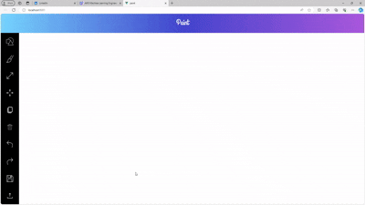

# 🎨 PaintIt

[](https://www.docker.com/)
[](https://nodejs.org/)
[](https://vuejs.org/)
[](https://opensource.org/licenses/MIT)

---

## 📜 Description

The PaintIt is a drawing and painting web application that allows users to create, modify, and manipulate geometric shapes interactively.  
Built using **Node.js** for the backend and **Vue.js** for the frontend, fully **Dockerized** for easy deployment.

It supports a variety of functionalities such as drawing, coloring, resizing, moving, copying, deleting shapes, undo/redo, and saving/loading files.

---

## ✨ Features

- 🎨 **Geometric Shapes**: Line Segment, Circle, Ellipse, Triangle, Rectangle, Square.
- 🔥 **Real-Time Editing**: Draw, move, copy, resize, delete shapes interactively.
- 📝 **Undo/Redo**: Manage changes effortlessly.
- 💾 **Save and Load**: In **XML** and **JSON** formats.
- 🖱️ **Mouse-Based Interaction**: Drag and draw easily.
- 💬 **Modern UI**: Responsive and intuitive interface.
- 📦 **Dockerized Setup**: Run everything easily with Docker Compose.

---

## 🛠 Technologies Used

- **Backend**: Node.js (Express)
- **Frontend**: Vue.js
- **Data Storage**: XML, JSON
- **Containerization**: Docker, Docker Compose

---

## 🚀 Installation & Setup

1. **Clone the repository:**

   ```bash
   git clone https://github.com/OmarHani4306/Paint-App.git
   cd Paint-App
   ```

2. **Run with Docker:**
   Make sure you have **Docker** and **Docker Compose** installed, then run:

   ```bash
   sudo docker compose up --build
   ```

3. **Access the application:**
   - Frontend (Vue.js): [http://localhost:8081](http://localhost:8081)
   - Backend (Node.js): [http://localhost:8080](http://localhost:8080)

---

## 🧩 Usage

1. Draw shapes from the toolbar.
2. Modify shapes (resize, move, copy, delete).
3. Undo and redo actions as needed.
4. Save your artwork to **XML** or **JSON**.
5. Load saved drawings and continue editing.

---

## 🎥 Demo Video



---

## 👥 Contributors

- [**Omar Hani**](https://github.com/OmarHani4306)
- [**Mohamed Mohamed Ibrahim**](https://github.com/Mohamed-Mohamed-Ibrahim)
- [**Mohamed Hasan**](https://github.com/mohassan5286)

---

## ⚖ License

This project is licensed under the **MIT License**.

---

## 📂 Project Structure

```
Paint-App/
├── backend/            # Node.js Express server
│   ├── Dockerfile
│   ├── package.json
│   └── (backend code)
├── frontend/           # Vue.js application
│   ├── Dockerfile
│   ├── package.json
│   └── (frontend code)
├── docker-compose.yml  # Docker Compose setup
└── README.md
```

---

## ⚡ Quick Commands

- **Start project**:
  ```bash
  sudo docker compose up --build
  ```
- **Stop project**:
  ```bash
  sudo docker compose down
  ```
- **Rebuild specific services**:
  ```bash
  sudo docker compose build frontend
  sudo docker compose build backend
  ```

---
